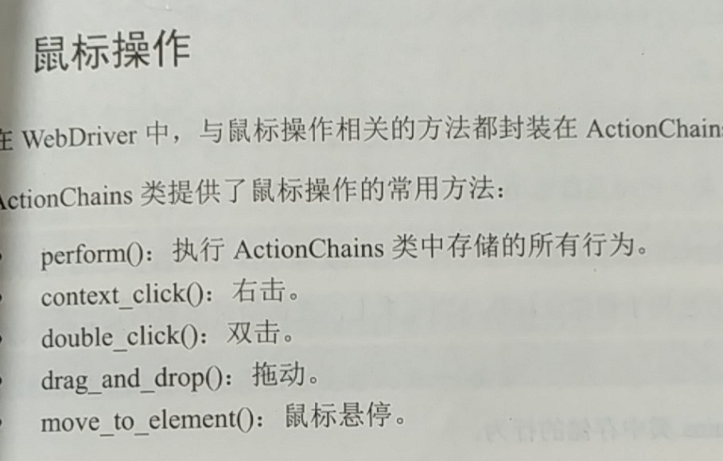

# web 自动化测试
## 简介
即web ui自动化测试，通过代码控制浏览器自动执行点点点等操作
## 环境搭建
1. python编程环境
2. python第三方库selenium webdriver(主流的开源框架，用于web应用程序测试的工具)————pip 安装
3. webdriver ——下载解压，复制到python的安装目录下（python38）
## 原理

即代码驱动浏览器执行点点点的操作，这个过程需要一个中间件即浏览器驱动（驱动程序），不同的浏览器需要使用不同的驱动
## BDD(Behavior-Driven Development)——行为驱动开发\TDD(Test-Driven Development)——测试驱动开发
保证代码质量，功能实现（详细介绍）
- BDD:先写功能需求点描述，开发根据描述进行开发，避免闭门造车
- TDD：先写测试，再实现代码，不停的迭代重构循环
## selenium webdriver（操作页面上的各种元素或者操作浏览器）
selenium API提供了操作web的类和方法，使用这些方法就可以操作web页面上的元素  
- 对所有的元素的操作原理都提供了定位和处理的操作方法
from selenium import webdriver
### 元素操作（定位元素）
需要根据前端代码决定定位方式
1. name ：driver.find_element_by_name
2. class ：driver.find_element_by_class_name
3. tag: driver.find_element_by_tag_name
4. link: driver.find_element_by_link_text
5. id ：driver.find_element_by_id
6. partial link: driver.find_element_by_partial_link_text(链接的部分文字)
7. XPath——driver.find_element_by_xpath()
    - 绝对路径("//标签[@属性=""]")
    - 元素属性
    - 层级与属性结合
    - 逻辑运算符
    - contains方法
    - text()方法
8. CSS（比xpath速度快）driver.find_element_by_css_selector()
    - class——.
    - id——#
    - tag——
    - 标签层级关系>
    - 属性[name = '']
    - 组合
    - 其它（W3CSchool网站CSS选择器参考手册）
9. by(from selenium.driver.common.by import by)
### 浏览器操作
1. 前进——driver.forward()
2. 后退——driver.back()
3. 刷新——driver.refresh()
4. 窗口大小——driver.set_window_size(480,800)
### webdriver中的常用方法(对定位到元素的操作)
1. clear()\send_keys('value')\click()\submit()\size\text\get_attribute(id\type\name)\is_displayed()
### 鼠标操作
from selenium.webdriver import ActionChains
- 使用：
- ActionChains(driver).move_to_element(定位到的元素).perform()
  
### 键盘操作
from selenium.webdriver.commom.keys import Keys
- .send_keys("内容")
### 验证信息
title\current_url\text
### 设置元素等待（webdriver等待某个条件成立后再继续执行）
1. 显式等待：
  - webdriverWait(driver, 5, 0.5).until(条件：通过expect_conditons.预期条件判断方法进行判断)/until_not()
  - is_display()方法进行判断
2. 隐式等待：implicitly_wait(10)不是必须等待十秒才执行
### 多表单切换（frame）
switch_to.frame()
switch_to.default_content()
### 多窗口切换
通过窗口句柄进行判断和切换
driver.
- current_window_handle()
- window_handles
- switch_to.window()
### 警告框处理
- 获取警告框（driver.switch_to.alert()）
- 对警告框进行处理
  - text-返回文字
  - accep（）接收
  - dismiss（）解散
  send_keys()
### 下拉框处理（webdriver 提供了Select类处理下拉框）
使用：Select(下拉框元素).select_by_value()/visible_text()/index()
### 上传文件
- 普通上传：将文件路径作为一个值通过send_keys()传入到input标签中
- 插件上传（flash,js,ajax等技术）
### 下载文件
将下载路径（指定、默认等）设置到浏览器设置参数中，见参数传入driver中（driver = webdriver.chrome(chrome_options=options)）
### 操作cookie
### 调用JS
有些页面操作无法靠webdriver API完成，比如滚动条的拖动，可通过execute_script()方法执行JS代码
- 滚动条处理
- HTML视频播放
### 滑动解锁
通过鼠标操作ActionChains类
- TouchActions类
### 窗口截图
driver.save_screenshot("保存目录")
### 关闭窗口
quit()---关闭浏览器
close()---关闭当前窗口
