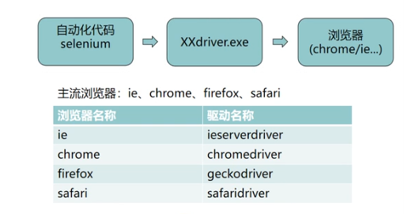

# web 自动化测试
## 学习关键点：封装、PO、组织用例、框架设计、BDD\TDD(保证代码质量，功能)
## 简介
web自动化测试即UI自动化测试，通过
## 环境搭建
1. python语言
2. python第三方库selenium webdriver(主流的开源框架)————pip 安装
3. webdriver ——下载解压，复制到python的安装目录下（python38）
## 原理

即代码驱动浏览器执行点点点的操作，这个过程需要一个中间件即浏览器驱动（驱动程序），不同的浏览器需要使用不同的驱动
## BDD(Behavior-Driven Development)——行为驱动开发\TDD(Test-Driven Development)——测试驱动开发
保证代码质量，功能实现（详细介绍）
- BDD:先写功能需求点描述，开发根据描述进行开发，避免闭门造车
- TDD：先写测试，再实现代码，不停的迭代重构循环
## selenium webdriver（操作页面上的各种元素或者操作浏览器）
### 元素操作
1. name ：driver.find_element_by_name
2. class ：driver.find_element_by_class_name
3. tag: driver.find_element_by_tag_name
4. link: driver.find_element_by_link_text
5. id ：driver.find_element_by_id
6. partial link: driver.find_element_by_partial_link_text(链接的部分文字)
7. XPath——driver.find_element_by_xpath()
    - 绝对路径("//标签[@属性=""]")
    - 元素属性
    - 层级与属性结合
    - 逻辑运算符
    - contains方法
    - text()方法
8. CSS（比xpath速度快）driver.find_element_by_css_selector()
    - class——.
    - id——#
    - tag——
    - 标签层级关系>
    - 属性[name = '']
    - 组合
    - 其它（W3CSchool网站CSS选择器参考手册）
9. by(from selenium.driver.common.by import by)
### 浏览器操作
1. 前进——driver.forward()
2. 后退——driver.back()
3. 刷新——driver.refresh()
### webdriver中的常用方法
1. clear()\send_keys('value')\click()\submit()\size\text\get_attribute(id\type\name)\is_displayed()
### 鼠标
ccccccccccccccccccccccccccccccccccccccccccc
## 自动化测试模型
1. 模块化与参数化
2. 读取数据文件
覆盖  单元测试主要技术手段